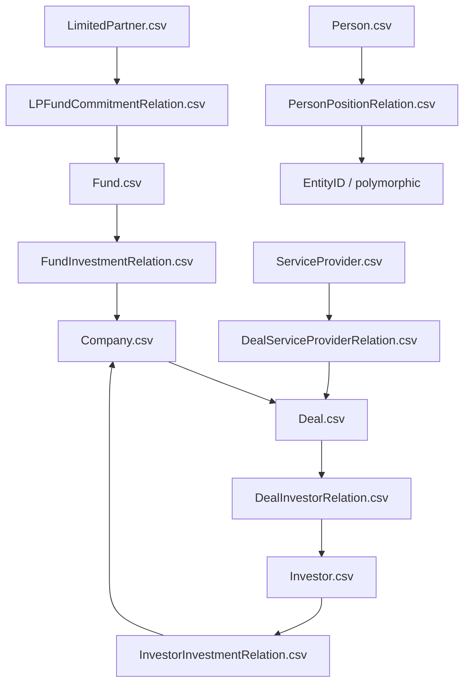

# 跨表關聯與 Join 指南

本文件只依據正式 CSV 的欄位名與官方 data dictionary 整理可見的 join 線索，不依賴實際資料值。

## 主實體表

| 主表 | 主鍵 | 角色 |
| --- | --- | --- |
| `Company.csv` | `CompanyID` | 公司主體、被投企業、目標公司等核心實體。 |
| `Deal.csv` | `DealID` | 融資、併購、退出等交易事件。 |
| `Investor.csv` | `InvestorID` | 投資機構。 |
| `Fund.csv` | `FundID` | 基金載體。 |
| `LimitedPartner.csv` | `LimitedPartnerID` | LP / 出資方。 |
| `Person.csv` | `PersonID` | 人員、合夥人、董事、聯絡人。 |
| `ServiceProvider.csv` | `ServiceProviderID` | 服務機構，例如律所、顧問、會計師。 |

## 常見外鍵規則

- `CompanyID` 幾乎都連到 `Company.csv`。
- `DealID` 幾乎都連到 `Deal.csv`。
- `InvestorID` 幾乎都連到 `Investor.csv`。
- `FundID` 幾乎都連到 `Fund.csv`。
- `LimitedPartnerID` 幾乎都連到 `LimitedPartner.csv`。
- `PersonID`、`LeadPartnerID`、`PrimaryContactPBId`、`CEOPBId` 常可連到 `Person.csv`。
- `EntityID` 是 polymorphic key，通常可對應 `Company / Investor / ServiceProvider` 等多種主表。
- `RepresentingID` 也是半泛型鍵，常代表董事席位或職務所屬的外部機構。

## Relation 表與主表連法

### Company 類

| Relation 表 | 可見主鍵/外鍵 | 主要 join 方向 |
| --- | --- | --- |
| `CompanyAffiliateRelation.csv` | `CompanyID`, `AffiliateID`, `RowID` | 可連到 Company.csv；關聯實體鍵，本批資料未提供單獨主表；列級稽核鍵；列級更新時間 |
| `CompanyBoardSeatHeldRelation.csv` | `CompanyID`, `PersonID`, `RowID` | 可連到 Company.csv；可連到 Person.csv；列級稽核鍵；列級更新時間 |
| `CompanyBuySideRelation.csv` | `CompanyID`, `TargetCompanyID`, `DealID`, `LeadPartnerID`, `RowID` | 可連到 Company.csv；可連到 Deal.csv；通常可連到 Person.csv；列級稽核鍵；列級更新時間 |
| `CompanyCompetitorRelation.csv` | `CompanyID`, `CompetitorID`, `RowID` | 可連到 Company.csv；通常可連到 Company.csv；列級稽核鍵；列級更新時間 |
| `CompanyEmployeeHistoryRelation.csv` | `CompanyID`, `RowID` | 可連到 Company.csv；列級稽核鍵；列級更新時間 |
| `CompanyEntityTypeRelation.csv` | `CompanyID`, `RowID` | 可連到 Company.csv；列級稽核鍵；列級更新時間 |
| `CompanyFinancialRelation.csv` | `CompanyID`, `RowID` | 可連到 Company.csv；列級稽核鍵；列級更新時間 |
| `CompanyIndustryRelation.csv` | `CompanyID`, `RowID` | 可連到 Company.csv；列級稽核鍵；列級更新時間 |
| `CompanyInvestorRelation.csv` | `CompanyID`, `InvestorID`, `RowID` | 可連到 Company.csv；可連到 Investor.csv；列級稽核鍵；列級更新時間 |
| `CompanyLocationRelation.csv` | `CompanyID`, `RowID` | 可連到 Company.csv；列級稽核鍵；列級更新時間 |
| `CompanyMorningstarCodeRelation.csv` | `CompanyID`, `RowID` | 可連到 Company.csv；列級稽核鍵；列級更新時間 |
| `CompanyNaicsCodeRelation.csv` | `CompanyID`, `RowID` | 可連到 Company.csv；列級稽核鍵；列級更新時間 |
| `CompanyPublicFinancialRelation.csv` | `CompanyID`, `RowID` | 可連到 Company.csv；列級稽核鍵；列級更新時間 |
| `CompanyServiceProviderRelation.csv` | `CompanyID`, `ServiceProviderID`, `RowID` | 可連到 Company.csv；可連到 ServiceProvider.csv；列級稽核鍵；列級更新時間 |
| `CompanySicCodeRelation.csv` | `CompanyID`, `RowID` | 可連到 Company.csv；列級稽核鍵；列級更新時間 |
| `CompanySimilarRelation.csv` | `CompanyID`, `SimilarCompanyID`, `RowID` | 可連到 Company.csv；列級稽核鍵；列級更新時間 |
| `CompanyVerticalRelation.csv` | `CompanyID`, `RowID` | 可連到 Company.csv；列級稽核鍵；列級更新時間 |

### Deal 類

| Relation 表 | 可見主鍵/外鍵 | 主要 join 方向 |
| --- | --- | --- |
| `DealCapTableRelation.csv` | `DealID`, `CapTableID`, `RowID` | 可連到 Deal.csv；股權結構鍵，本批資料未提供單獨主表；列級稽核鍵；列級更新時間 |
| `DealDebtLenderRelation.csv` | `DealID`, `FacilityID`, `LenderID`, `RowID` | 可連到 Deal.csv；額度鍵，本批資料未提供單獨主表；貸方鍵，本批資料未提供單獨主表；列級稽核鍵；列級更新時間 |
| `DealDistribBeneficiaryRelation.csv` | `DealID`, `BeneficiaryID`, `Fund1ID`, `Fund2ID`, `RowID` | 可連到 Deal.csv；受益方鍵，本批資料未提供單獨主表；通常可連到 Fund.csv；列級稽核鍵；列級更新時間 |
| `DealInvestorRelation.csv` | `DealID`, `InvestorID`, `InvestorFundID`, `LeadPartnerID`, `RowID` | 可連到 Deal.csv；可連到 Investor.csv；通常可連到 Fund.csv；通常可連到 Person.csv；列級稽核鍵；列級更新時間 |
| `DealSellerRelation.csv` | `DealID`, `Seller_ExiterID`, `Seller_ExiterFundID`, `RowID` | 可連到 Deal.csv；退出方鍵，可能對應投資機構、基金或其他持有人；通常可連到 Fund.csv；列級稽核鍵；列級更新時間 |
| `DealServiceProviderRelation.csv` | `DealID`, `ServiceProviderID`, `ServiceToID`, `LeadPartnerID`, `RowID` | 可連到 Deal.csv；可連到 ServiceProvider.csv；服務對象鍵，可能對應公司、基金、投資機構等；通常可連到 Person.csv；列級稽核鍵；列級更新時間 |
| `DealTrancheRelation.csv` | `DealID`, `InvestorID`, `RowID` | 可連到 Deal.csv；可連到 Investor.csv；列級稽核鍵；列級更新時間 |

### Investor 類

| Relation 表 | 可見主鍵/外鍵 | 主要 join 方向 |
| --- | --- | --- |
| `InvestorAffiliateRelation.csv` | `InvestorID`, `AffiliateID`, `RowID` | 可連到 Investor.csv；關聯實體鍵，本批資料未提供單獨主表；列級稽核鍵；列級更新時間 |
| `InvestorCoInvestorRelation.csv` | `InvestorID`, `Co_InvestorID`, `RowID` | 可連到 Investor.csv；列級稽核鍵；列級更新時間 |
| `InvestorEntityTypeRelation.csv` | `InvestorID`, `RowID` | 可連到 Investor.csv；列級稽核鍵；列級更新時間 |
| `InvestorExitRelation.csv` | `InvestorID`, `CompanyID`, `DealID`, `RowID` | 可連到 Investor.csv；可連到 Company.csv；可連到 Deal.csv；列級稽核鍵；列級更新時間 |
| `InvestorFundRelation.csv` | `InvestorID`, `FundID`, `RowID` | 可連到 Investor.csv；可連到 Fund.csv；列級稽核鍵；列級更新時間 |
| `InvestorInvestDealRelation.csv` | `InvestorID`, `RowID` | 可連到 Investor.csv；列級稽核鍵；列級更新時間 |
| `InvestorInvestIndustryCodeRelation.csv` | `InvestorID`, `RowID` | 可連到 Investor.csv；列級稽核鍵；列級更新時間 |
| `InvestorInvestIndustrySectorCodeRelation.csv` | `InvestorID`, `RowID` | 可連到 Investor.csv；列級稽核鍵；列級更新時間 |
| `InvestorInvestYearRelation.csv` | `InvestorID`, `RowID` | 可連到 Investor.csv；列級稽核鍵；列級更新時間 |
| `InvestorInvestmentRelation.csv` | `InvestorID`, `CompanyID`, `DealID`, `ExitDealID`, `LeadPartnerID`, `RowID` | 可連到 Investor.csv；可連到 Company.csv；可連到 Deal.csv；通常可連到 Person.csv；列級稽核鍵；列級更新時間 |
| `InvestorLeadPartnerRelation.csv` | `InvestorID`, `PersonID`, `RowID` | 可連到 Investor.csv；可連到 Person.csv；列級稽核鍵；列級更新時間 |
| `InvestorLimitedPartnerRelation.csv` | `InvestorID`, `LimitedPartnerID`, `RowID` | 可連到 Investor.csv；可連到 LimitedPartner.csv；列級稽核鍵；列級更新時間 |
| `InvestorLocationRelation.csv` | `InvestorID`, `RowID` | 可連到 Investor.csv；列級稽核鍵；列級更新時間 |
| `InvestorServiceProviderRelation.csv` | `InvestorID`, `ServiceProviderID`, `RowID` | 可連到 Investor.csv；可連到 ServiceProvider.csv；列級稽核鍵；列級更新時間 |

### Fund 類

| Relation 表 | 可見主鍵/外鍵 | 主要 join 方向 |
| --- | --- | --- |
| `FundCloseHistoryRelation.csv` | `FundID`, `RowID` | 可連到 Fund.csv；列級稽核鍵；列級更新時間 |
| `FundInvestmentRelation.csv` | `FundID`, `CompanyID`, `DealID`, `ExitDealID`, `LeadPartnerID`, `RowID` | 可連到 Fund.csv；可連到 Company.csv；可連到 Deal.csv；通常可連到 Person.csv；列級稽核鍵；列級更新時間 |
| `FundInvestorRelation.csv` | `FundID`, `InvestorID`, `RowID` | 可連到 Fund.csv；可連到 Investor.csv；列級稽核鍵；列級更新時間 |
| `FundLPCommitmentRelation.csv` | `FundID`, `LimitedPartnerID`, `CommitmentID`, `RowID` | 可連到 Fund.csv；可連到 LimitedPartner.csv；承諾出資鍵，本批資料未提供單獨主表；列級稽核鍵；列級更新時間 |
| `FundLimitedPartnerRelation.csv` | `FundID`, `LimitedPartnerID`, `RowID` | 可連到 Fund.csv；可連到 LimitedPartner.csv；列級稽核鍵；列級更新時間 |
| `FundReturnRelation.csv` | `FundID`, `RowID` | 可連到 Fund.csv；列級稽核鍵；列級更新時間 |
| `FundReturnReporterRelation.csv` | `FundID`, `SourceID`, `CommitmentID`, `RowID` | 可連到 Fund.csv；來源鍵，本批資料未提供單獨主表；承諾出資鍵，本批資料未提供單獨主表；列級稽核鍵；列級更新時間 |
| `FundServiceProviderRelation.csv` | `FundID`, `ServiceProviderID`, `ServiceToID`, `RowID` | 可連到 Fund.csv；可連到 ServiceProvider.csv；服務對象鍵，可能對應公司、基金、投資機構等；列級稽核鍵；列級更新時間 |
| `FundTeamRelation.csv` | `FundID`, `PersonID`, `RowID` | 可連到 Fund.csv；可連到 Person.csv；列級稽核鍵；列級更新時間 |

### LP / LimitedPartner 類

| Relation 表 | 可見主鍵/外鍵 | 主要 join 方向 |
| --- | --- | --- |
| `LPDirectInvestmentRelation.csv` | `LimitedPartnerID`, `CompanyID`, `RowID` | 可連到 LimitedPartner.csv；可連到 Company.csv；列級稽核鍵；列級更新時間 |
| `LPFundCommitmentRelation.csv` | `LimitedPartnerID`, `FundID`, `RowID` | 可連到 LimitedPartner.csv；可連到 Fund.csv；列級稽核鍵；列級更新時間 |

### Person 類

| Relation 表 | 可見主鍵/外鍵 | 主要 join 方向 |
| --- | --- | --- |
| `PersonAdvisoryRelation.csv` | `PersonID`, `EntityID`, `RowID` | 可連到 Person.csv；泛實體鍵，可對應 Company / Investor / ServiceProvider 等主表；列級稽核鍵；列級更新時間 |
| `PersonAffiliatedDealRelation.csv` | `PersonID`, `DealID`, `RepresentingID`, `CompanyID`, `RowID` | 可連到 Person.csv；可連到 Deal.csv；代表實體鍵，可能連到 Investor / Fund / 其他機構；可連到 Company.csv；列級稽核鍵；列級更新時間 |
| `PersonAffiliatedFundRelation.csv` | `PersonID`, `InvestorID`, `FundID`, `RowID` | 可連到 Person.csv；可連到 Investor.csv；可連到 Fund.csv；列級稽核鍵；列級更新時間 |
| `PersonBoardSeatRelation.csv` | `PersonID`, `CompanyID`, `RepresentingID`, `RowID` | 可連到 Person.csv；可連到 Company.csv；代表實體鍵，可能連到 Investor / Fund / 其他機構；列級稽核鍵；列級更新時間 |
| `PersonEducationRelation.csv` | `PersonID`, `RowID` | 可連到 Person.csv；列級稽核鍵；列級更新時間 |
| `PersonPositionRelation.csv` | `PersonID`, `EntityID`, `RowID` | 可連到 Person.csv；泛實體鍵，可對應 Company / Investor / ServiceProvider 等主表；列級稽核鍵；列級更新時間 |

### Entity 類

| Relation 表 | 可見主鍵/外鍵 | 主要 join 方向 |
| --- | --- | --- |
| `EntityAffiliateRelation.csv` | `EntityID`, `AffiliateID`, `RowID` | 泛實體鍵，可對應 Company / Investor / ServiceProvider 等主表；關聯實體鍵，本批資料未提供單獨主表；列級稽核鍵；列級更新時間 |
| `EntityBoardSeatHeldRelation.csv` | `EntityID`, `PersonID`, `RowID` | 泛實體鍵，可對應 Company / Investor / ServiceProvider 等主表；可連到 Person.csv；可連到 Company.csv；列級稽核鍵；列級更新時間 |
| `EntityBoardTeamRelation.csv` | `EntityID`, `PersonID`, `RepresentingID`, `RowID` | 泛實體鍵，可對應 Company / Investor / ServiceProvider 等主表；可連到 Person.csv；代表實體鍵，可能連到 Investor / Fund / 其他機構；列級稽核鍵；列級更新時間 |
| `EntityLocationRelation.csv` | `EntityID`, `RowID` | 泛實體鍵，可對應 Company / Investor / ServiceProvider 等主表；列級稽核鍵；列級更新時間 |

### ServiceProvider 類

| Relation 表 | 可見主鍵/外鍵 | 主要 join 方向 |
| --- | --- | --- |
| `ServiceProviderCompDealRelation.csv` | `ServiceProviderID`, `CompanyID`, `DealID`, `RowID` | 可連到 ServiceProvider.csv；可連到 Company.csv；可連到 Deal.csv；列級稽核鍵；列級更新時間 |
| `ServiceProviderCompanyRelation.csv` | `ServiceProviderID`, `CompanyID`, `RowID` | 可連到 ServiceProvider.csv；可連到 Company.csv；列級稽核鍵；列級更新時間 |
| `ServiceProviderInvFundRelation.csv` | `ServiceProviderID`, `FundID`, `InvestorID`, `RowID` | 可連到 ServiceProvider.csv；可連到 Fund.csv；可連到 Investor.csv；列級稽核鍵；列級更新時間 |
| `ServiceProviderInvestorRelation.csv` | `ServiceProviderID`, `InvestorID`, `DealID`, `RowID` | 可連到 ServiceProvider.csv；可連到 Investor.csv；可連到 Deal.csv；列級稽核鍵；列級更新時間 |
| `ServiceProviderLPRelation.csv` | `ServiceProviderID`, `LimitedPartnerID`, `RowID` | 可連到 ServiceProvider.csv；可連到 LimitedPartner.csv；列級稽核鍵；列級更新時間 |

## 常用 Join 路徑

1. 公司看所有交易：`Company.CompanyID -> Deal.CompanyID`。
2. 交易看投資方：`Deal.DealID -> DealInvestorRelation.DealID -> Investor.InvestorID`。
3. 投資機構看被投公司：`Investor.InvestorID -> InvestorInvestmentRelation.InvestorID -> Company.CompanyID`。
4. 基金看投資標的：`Fund.FundID -> FundInvestmentRelation.FundID -> Company.CompanyID`。
5. LP 看出資基金：`LimitedPartner.LimitedPartnerID -> LPFundCommitmentRelation.LimitedPartnerID -> Fund.FundID`。
6. 人員看任職實體：`Person.PersonID -> PersonPositionRelation.PersonID -> EntityID`，再依 `EntityID` 去對應主表。

## `EntityID` 與 `RepresentingID` 的理解

- `EntityID`：泛實體 ID，不保證只對應單一主表。常見於 `Entity*Relation` 與人物任職/顧問資料。
- `RepresentingID`：代表某位董事、顧問或高管背後所屬機構的 ID，通常不是人物本身。
- 使用這兩類欄位時，應先根據所在表的語境判斷其指向的是公司、投資機構、基金或其他機構。

## 核心關聯圖

