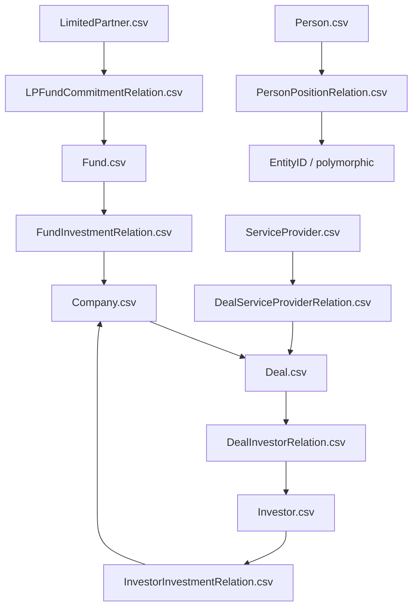

# 跨表關聯與 Join 指南

本文件只依據正式 CSV 的欄位名與官方 data dictionary 整理可見的 join 線索，不依賴實際資料值。

## 主實體表

| 主表 | 主鍵 | 角色 |
| --- | --- | --- |
| `Company.csv` | `CompanyID` | 公司主體、被投企業、目標公司等核心實體。 |
| `Deal.csv` | `DealID` | 融資、併購、退出等交易事件。 |
| `Investor.csv` | `InvestorID` | 投資機構。 |
| `Fund.csv` | `FundID` | 基金載體。 |
| `LimitedPartner.csv` | `LimitedPartnerID` | LP / 出資方。 |
| `Person.csv` | `PersonID` | 人員、合夥人、董事、聯絡人。 |
| `ServiceProvider.csv` | `ServiceProviderID` | 服務機構，例如律所、顧問、會計師。 |

## 常見外鍵規則

- `CompanyID` 幾乎都連到 `Company.csv`。
- `DealID` 幾乎都連到 `Deal.csv`。
- `InvestorID` 幾乎都連到 `Investor.csv`。
- `FundID` 幾乎都連到 `Fund.csv`。
- `LimitedPartnerID` 幾乎都連到 `LimitedPartner.csv`。
- `PersonID`、`LeadPartnerID`、`PrimaryContactPBId`、`CEOPBId` 常可連到 `Person.csv`。
- `EntityID` 是 polymorphic key，通常可對應 `Company / Investor / ServiceProvider` 等多種主表。
- `RepresentingID` 也是半泛型鍵，常代表董事席位或職務所屬的外部機構。

## Relation 表與主表連法

下表除了列出 join 方向，也強調每張 relation 表相對主表額外補充了哪些重點欄位。可把這些欄位理解為「這張表之所以值得單獨存在」的原因。

### Company 類

| Relation 表 | 主要 join 方向 | 該 relation 獨立且重點提供的 columns | 這張表能提供的特色內容 |
| --- | --- | --- | --- |
| `CompanyAffiliateRelation.csv` | `CompanyID -> Company.csv` | `AffiliateName`, `Industry`, `YearFounded`, `AffiliateType`, `HQCity`, `HQState_Province`, `HQCountry` | 補公司關聯機構名單，適合看子公司、姊妹公司、其他附屬實體，以及其產業與地理分布。 |
| `CompanyBoardSeatHeldRelation.csv` | `CompanyID -> Company.csv`；`PersonID -> Person.csv` | `CompanyIDHeld`, `CompanyNameHeld`, `RoleOnBoard`, `Industry`, `Location`, `StartDate` | 補公司相關人物在其他公司持有董事席位的情況，適合看外部董事網路與董事影響範圍。 |
| `CompanyBuySideRelation.csv` | `CompanyID -> Company.csv`；`TargetCompanyID -> Company.csv`；`DealID -> Deal.csv`；`LeadPartnerID -> Person.csv` | `TargetCompanyName`, `DealDate`, `DealType`, `DealSize`, `CompanyStage`, `Industry`, `LeadPartner` | 補公司作為買方時的收購活動，適合分析併購擴張、收購標的類型與 deal lead。 |
| `CompanyCompetitorRelation.csv` | `CompanyID -> Company.csv`；`CompetitorID -> Company.csv` | `CompetitorDescription`, `CompetitorPrimaryIndustrySector`, `CompetitorPrimaryIndustryGroup`, `CompetitorPrimaryIndustryCode`, `CompetitorAllIndustries`, `CompetitorVerticals` | 補公司競爭對手圖譜，且直接附帶對手的產業、vertical 與描述，不必先回主表才知道大致輪廓。 |
| `CompanyEmployeeHistoryRelation.csv` | `CompanyID -> Company.csv` | `EmployeeCount`, `Date` | 補公司歷史員工數時間序列，適合看 headcount 成長與收縮。 |
| `CompanyEntityTypeRelation.csv` | `CompanyID -> Company.csv` | `EntityType`, `IsPrimary` | 補公司實體類型標籤，適合判斷是 operating company、holding entity 或其他法務/商業類型。 |
| `CompanyFinancialRelation.csv` | `CompanyID -> Company.csv` | `FiscalPeriod`, `Revenue`, `GrossProfit`, `NetIncome`, `EnterpriseValue`, `EBITDA`, `EBIT`, `NetDebt`, `PeriodEndDate` | 補公司私有財務快照，適合看不同會計期間的核心財務指標。 |
| `CompanyIndustryRelation.csv` | `CompanyID -> Company.csv` | `IndustrySector`, `IndustryGroup`, `IndustryCode`, `IsPrimary` | 補公司多產業分類與主次分類，適合做產業橫切分析。 |
| `CompanyInvestorRelation.csv` | `CompanyID -> Company.csv`；`InvestorID -> Investor.csv` | `InvestorName`, `InvestorStatus`, `Holding`, `InvestorSince`, `InvestorWebsite` | 補公司 cap table / 投資人名單，適合看現任與歷史投資人、持股與入場時間。 |
| `CompanyLocationRelation.csv` | `CompanyID -> Company.csv` | `LocationName`, `LocationType`, `LocationStatus`, `Address1`, `Address2`, `City`, `State`, `PostCode`, `Country`, `OfficePhone`, `OfficeFax` | 補公司多辦公地點與據點狀態，適合看總部以外的營運網路。 |
| `CompanyMorningstarCodeRelation.csv` | `CompanyID -> Company.csv` | `MorningstarCode`, `MorningstarDescription` | 補 Morningstar 分類碼，適合和外部金融分類體系對齊。 |
| `CompanyNaicsCodeRelation.csv` | `CompanyID -> Company.csv` | `NaicsSectorCode`, `NaicsSectorDescription`, `NaicsIndustryCode`, `NaicsIndustryDescription` | 補 NAICS 標準產業碼，適合與美國官方產業分類體系對接。 |
| `CompanyPublicFinancialRelation.csv` | `CompanyID -> Company.csv` | `FiscalPeriodType`, `TotalRevenue`, `TotalAssets`, `TotalLiabilities`, `CurrentRatio`, `QuickRatio`, `DebtToEquity`, `EnterpriseValueToRevenue`, `EnterpriseValueToEBITDA`, `Preliminary`, `Original`, `Restated`, `Calculated` | 補公開公司更完整的報表、比率與口徑標記，適合做公開市場財務分析。 |
| `CompanyServiceProviderRelation.csv` | `CompanyID -> Company.csv`；`ServiceProviderID -> ServiceProvider.csv` | `ServiceProviderName`, `ServiceProvided`, `ServiceProviderType` | 補公司合作的律所、顧問、審計等服務機構與服務內容。 |
| `CompanySicCodeRelation.csv` | `CompanyID -> Company.csv` | `SicCode`, `SicDescription` | 補 SIC 產業碼，適合和另一套標準產業體系對照。 |
| `CompanySimilarRelation.csv` | `CompanyID -> Company.csv`；`SimilarCompanyID -> Company.csv` | `SimilarityRank`, `SimilarityScore`, `IsCompetitor`, `SimilarDescription`, `SimilarPrimaryIndustrySector`, `SimilarPrimaryIndustryGroup`, `SimilarPrimaryIndustryCode`, `SimilarAllIndustries`, `SimilarVerticals`, `SimilarCompanyHQCity`, `SimilarCompanyHQCountry` | 補 PitchBook 相似公司圖譜，適合從單一公司擴展到可比公司、競品池與鄰近主題公司。 |
| `CompanyVerticalRelation.csv` | `CompanyID -> Company.csv` | `Vertical` | 補公司多個 vertical 標籤，適合做主題式篩選，例如 AI、FinTech、Blockchain。 |

### Deal 類

| Relation 表 | 主要 join 方向 | 該 relation 獨立且重點提供的 columns | 這張表能提供的特色內容 |
| --- | --- | --- | --- |
| `DealCapTableRelation.csv` | `DealID -> Deal.csv` | `CapTableID`, `SeriesOfStock`, `NumberOfSharesAuthorized`, `ParValue`, `DividendRatePercentage`, `OriginalIssuePrice`, `LiquidationPrice`, `LiquidationPreferenceMultiple`, `ConversionPrice`, `PercentOwned`, `TypeOfStock`, `SharesSought`, `PriceperShare`, `NumberOfSharesAcquired`, `AntiDilutionProvisions`, `RedemptionRights`, `BoardVotingRights`, `GeneralVotingRights` | 補交易對應的股權結構與證券條款，適合分析優先股條款、清算優先權、稀釋保護與表決權。 |
| `DealDebtLenderRelation.csv` | `DealID -> Deal.csv` | `DebtRound`, `FacilityID`, `LenderName`, `LenderTitle`, `LenderType`, `Fund1`, `Fund1Amount`, `Fund2`, `Fund2Amount`, `DebtAmount`, `PIK`, `MaturityDate`, `Spread_InterestRate`, `Seniority`, `Security`, `Rate`, `DebtInstruments`, `OID_Price`, `PrimaryYTM`, `LeadArranger`, `TotalLenders`, `RefResetFrequency`, `Cost`, `Tenor`, `PercentOfDebt` | 補債務交易的貸方結構與債務條款，適合看貸方組成、利率結構、期限、擔保與分層。 |
| `DealDistribBeneficiaryRelation.csv` | `DealID -> Deal.csv`；`Fund1ID/Fund2ID -> Fund.csv` | `BeneficiaryName`, `IRRPercentage`, `ExitMultiple`, `Fund1Name`, `Fund1Amount`, `Fund2Name`, `Fund2Amount`, `PercentageOfCompanyStillHeld`, `Currency` | 補退出或分配事件的受益方與回報分配，適合看誰從交易中獲益、回報倍數與仍保留的持股比例。 |
| `DealInvestorRelation.csv` | `DealID -> Deal.csv`；`InvestorID -> Investor.csv`；`InvestorFundID -> Fund.csv`；`LeadPartnerID -> Person.csv` | `InvestorName`, `InvestorStatus`, `IsLeadInvestor`, `InvestorFundName`, `InvestorWebsite`, `InvestorInvestmentAmount`, `LeadPartnerName` | 補每筆交易的投資方名單與角色，適合看 lead investor、參投基金與單一投資人出資額。 |
| `DealSellerRelation.csv` | `DealID -> Deal.csv`；`Seller_ExiterFundID -> Fund.csv` | `Seller_ExiterName`, `Partial_Full`, `PercentOfCompanySold`, `PercentOfCompanyStillHeld`, `Seller_ExiterFundName`, `EntryAmount`, `ExitAmount`, `TimeToExit` | 補退出方 / 賣方細節，適合看部分退出或完全退出、入場金額、退出金額與持有時間。 |
| `DealServiceProviderRelation.csv` | `DealID -> Deal.csv`；`ServiceProviderID -> ServiceProvider.csv`；`LeadPartnerID -> Person.csv` | `ServiceProviderName`, `ServiceProvided`, `ServiceProviderType`, `ServiceToID`, `ServiceToName`, `BuySide_SellSide`, `Comments`, `LeadPartnerName` | 補交易中的中介服務方與服務對象，適合看哪家律所、顧問、會計師服務買方或賣方。 |
| `DealTrancheRelation.csv` | `DealID -> Deal.csv`；`InvestorID/InvestorID2/InvestorID3 -> Investor.csv` | `TrancheDate`, `Amount`, `FinancingType`, `StockType`, `StockSeriesType`, `ConversionStatus`, `ConversionDate`, `Investor`, `Investor2`, `Investor3` | 補一筆交易被拆成多 tranche 的情況，適合看分期撥款、不同 tranche 的股權工具與投資人配置。 |

### Investor 類

| Relation 表 | 主要 join 方向 | 該 relation 獨立且重點提供的 columns | 這張表能提供的特色內容 |
| --- | --- | --- | --- |
| `InvestorAffiliateRelation.csv` | `InvestorID -> Investor.csv` | `AffiliateName`, `Industry`, `YearFounded`, `AffiliateType`, `HQCity`, `HQState_Province`, `HQCountry` | 補投資機構的關聯實體與附屬機構網路。 |
| `InvestorCoInvestorRelation.csv` | `InvestorID -> Investor.csv`；`Co_InvestorID -> Investor.csv` | `Co_InvestorName`, `NumberOfInvestmentsWith` | 補共同投資關係，適合找 syndication network 與常見 co-investor 組合。 |
| `InvestorEntityTypeRelation.csv` | `InvestorID -> Investor.csv` | `EntityType`, `IsPrimary` | 補投資機構實體類型，適合區分 VC、PE、corporate investor 等身份標記。 |
| `InvestorExitRelation.csv` | `InvestorID -> Investor.csv`；`CompanyID -> Company.csv`；`DealID -> Deal.csv` | `CompanyName`, `ExitDate`, `ExitType`, `ExitSize`, `ExitStatus` | 補投資機構的退出紀錄，適合看退出方式、退出規模與最近退出活動。 |
| `InvestorFundRelation.csv` | `InvestorID -> Investor.csv`；`FundID -> Fund.csv` | `FundName` | 補投資機構名下基金列表，是 investor 與 fund 的基本連接表。 |
| `InvestorInvestDealRelation.csv` | `InvestorID -> Investor.csv` | `DealType`, `Deals`, `MedianSize`, `LastInvestment` | 補投資機構按交易類型聚合的投資偏好，適合看偏早期、成長輪、併購等分布。 |
| `InvestorInvestIndustryCodeRelation.csv` | `InvestorID -> Investor.csv` | `IndustrySector`, `IndustryGroup`, `IndustryCode`, `Deals`, `PercentageOfDeals`, `MedianSize`, `LastInvestment` | 補投資機構按產業碼聚合的投資分布，適合看產業專注度與過往活躍度。 |
| `InvestorInvestIndustrySectorCodeRelation.csv` | `InvestorID -> Investor.csv` | `Industry`, `Deals`, `MedianSize`, `LastInvestment` | 補較粗粒度的產業分布摘要，適合做快速行業偏好判讀。 |
| `InvestorInvestYearRelation.csv` | `InvestorID -> Investor.csv` | `Year`, `Deals`, `MedianSize`, `LastInvestment` | 補投資機構按年份聚合的投資活躍度，適合看投資節奏變化。 |
| `InvestorInvestmentRelation.csv` | `InvestorID -> Investor.csv`；`CompanyID -> Company.csv`；`DealID/ExitDealID -> Deal.csv`；`LeadPartnerID -> Person.csv` | `CompanyName`, `DealDate`, `TargetCompanyExitDate`, `LeadPartnerName`, `DealType`, `DealSize`, `CoInvestors`, `BusinessStatus`, `Industry` | 補投資機構逐筆投資履歷，適合直接看 portfolio company、deal 類型、co-investor 與退出日期。 |
| `InvestorLeadPartnerRelation.csv` | `InvestorID -> Investor.csv`；`PersonID -> Person.csv` | `FullName`, `AllDeals`, `Location` | 補投資機構內部 lead partner 名單與 deal 覆蓋數。 |
| `InvestorLimitedPartnerRelation.csv` | `InvestorID -> Investor.csv`；`LimitedPartnerID -> LimitedPartner.csv` | `LimitedPartnerName`, `LimitedPartnerLocation`, `Type`, `CommitmentsTo`, `LastCommitmentDate`, `LastCommitedFund`, `TotalCommitments` | 補投資機構背後 LP 名單與承諾概況，適合看募資來源。 |
| `InvestorLocationRelation.csv` | `InvestorID -> Investor.csv` | `LocationName`, `LocationType`, `LocationStatus`, `Address1`, `Address2`, `City`, `State`, `PostCode`, `Country`, `OfficePhone`, `OfficeFax` | 補投資機構多地辦公據點與狀態。 |
| `InvestorServiceProviderRelation.csv` | `InvestorID -> Investor.csv`；`ServiceProviderID -> ServiceProvider.csv` | `ServiceProviderName`, `ServiceProvided`, `ServiceProviderType` | 補投資機構使用的服務機構與服務類型。 |

### Fund 類

| Relation 表 | 主要 join 方向 | 該 relation 獨立且重點提供的 columns | 這張表能提供的特色內容 |
| --- | --- | --- | --- |
| `FundCloseHistoryRelation.csv` | `FundID -> Fund.csv` | `Amount`, `FundCloseDate`, `FundCloseType` | 補基金多次 close 的歷程，適合看 first close / final close 與募資節奏。 |
| `FundInvestmentRelation.csv` | `FundID -> Fund.csv`；`CompanyID -> Company.csv`；`DealID/ExitDealID -> Deal.csv`；`LeadPartnerID -> Person.csv` | `CompanyName`, `InvestmentStatus`, `DealDate`, `TargetCompanyExitDate`, `LeadPartner`, `DealType`, `DealSize`, `BusinessStatus`, `PrimaryIndustryCode` | 補基金逐筆投資履歷，適合看 portfolio、投資狀態與退出日期。 |
| `FundInvestorRelation.csv` | `FundID -> Fund.csv`；`InvestorID -> Investor.csv` | `InvestorName`, `InvestorWebsite` | 補基金與管理它的投資機構連接，適合建立 GP 到 fund 的映射。 |
| `FundLPCommitmentRelation.csv` | `FundID -> Fund.csv`；`LimitedPartnerID -> LimitedPartner.csv` | `LimitedPartnerName`, `LimitedPartnerType`, `CommitmentID`, `CommitmentStatus`, `Commitment`, `CommitmentDate`, `CommitmentType`, `Comments` | 補單筆 LP 承諾明細，適合看 commitment 金額、時間與狀態。 |
| `FundLimitedPartnerRelation.csv` | `FundID -> Fund.csv`；`LimitedPartnerID -> LimitedPartner.csv` | `LimitedPartnerName`, `LimitedPartnerType` | 補 fund 與 LP 的基礎關係名單，是 `FundLPCommitmentRelation` 的輕量版。 |
| `FundReturnRelation.csv` | `FundID -> Fund.csv` | `AsOfYear`, `AsOfQuarter`, `IRR`, `DPI`, `TVPI`, `RVPI`, `GainSinceInception`, `Contributed`, `CalledDownPercentage`, `DryPowder`, `NAV`, `Distributed`, `Quartile`, `IRRBenchmark`, `DPIBenchmark`, `TVPIBenchmark`, `RVPIBenchmark` | 補基金回報時間序列與 benchmark 對比，適合做 performance 分析。 |
| `FundReturnReporterRelation.csv` | `FundID -> Fund.csv` | `ReportingPeriod`, `NativeCommitted`, `NativeContributed`, `NativeDistributed`, `NativeNAV`, `NativeDryPowder`, `NativeCurrency`, `Source`, `SourceID`, `SourceType`, `CommitmentID`, `CommitmentType`, `IndividualLPCommitted`, `ReportingCurrency` | 補回報數字的報告來源、幣別與 commitment 層口徑，適合做數據來源審核。 |
| `FundServiceProviderRelation.csv` | `FundID -> Fund.csv`；`ServiceProviderID -> ServiceProvider.csv` | `ServiceProviderName`, `ServiceProvided`, `ServiceTo`, `ServiceToID`, `ServiceToName`, `Comments` | 補服務基金的律所、顧問、審計等服務方，且指出服務對象。 |
| `FundTeamRelation.csv` | `FundID -> Fund.csv`；`PersonID -> Person.csv` | `IsCurrent`, `FullName`, `FullTitle`, `AffiliatedDeals`, `AffiliatedFunds`, `ActiveBoardSeats`, `Location` | 補基金團隊成員與其 deal / fund / board 經驗。 |

### LP / LimitedPartner 類

| Relation 表 | 主要 join 方向 | 該 relation 獨立且重點提供的 columns | 這張表能提供的特色內容 |
| --- | --- | --- | --- |
| `LPDirectInvestmentRelation.csv` | `LimitedPartnerID -> LimitedPartner.csv`；`CompanyID -> Company.csv` | `CompanyName`, `DealDate`, `DealSize` | 補 LP 直接投公司的紀錄，適合區分純 fund investor 與有 direct investment 能力的 LP。 |
| `LPFundCommitmentRelation.csv` | `LimitedPartnerID -> LimitedPartner.csv`；`FundID -> Fund.csv` | `FundName`, `Commitment`, `CommitmentDate` | 補 LP 對基金的承諾出資明細，是 LP 視角的 commitment 表。 |

### Person 類

| Relation 表 | 主要 join 方向 | 該 relation 獨立且重點提供的 columns | 這張表能提供的特色內容 |
| --- | --- | --- | --- |
| `PersonAdvisoryRelation.csv` | `PersonID -> Person.csv`；`EntityID -> polymorphic` | `EntityName`, `IndustryCode`, `AdvisoryTitle`, `Location`, `IsCurrent`, `StartDate`, `EndDate` | 補人物顧問角色，適合看 advisory network 與任期。 |
| `PersonAffiliatedDealRelation.csv` | `PersonID -> Person.csv`；`DealID -> Deal.csv`；`RepresentingID -> polymorphic`；`CompanyID -> Company.csv` | `RepresentingEntityName`, `CompanyName`, `DealDate`, `DealType`, `DealSize` | 補人物參與過哪些 deal，以及當時代表哪個機構。 |
| `PersonAffiliatedFundRelation.csv` | `PersonID -> Person.csv`；`InvestorID -> Investor.csv`；`FundID -> Fund.csv` | `InvestorName`, `FundName` | 補人物與 investor / fund 的從屬關係，適合建立人到基金的連結。 |
| `PersonBoardSeatRelation.csv` | `PersonID -> Person.csv`；`CompanyID -> Company.csv`；`RepresentingID -> polymorphic` | `CompanyName`, `RepresentingName`, `RoleOnBoard`, `IsCurrent`, `Location`, `StartDate`, `EndDate` | 補人物董事席位、代表機構與任期，是公司治理分析核心表。 |
| `PersonEducationRelation.csv` | `PersonID -> Person.csv` | `Degree`, `Major_Concentration`, `Institute`, `GraduatingYear` | 補人物教育背景。 |
| `PersonPositionRelation.csv` | `PersonID -> Person.csv`；`EntityID -> polymorphic` | `EntityName`, `EntityType`, `EntityWebsite`, `FullTitle`, `PositionLevel`, `IsCurrent`, `Location`, `StartDate`, `EndDate` | 補人物歷任職位與實體類型，是看職涯路徑的核心表。 |

### Entity 類

| Relation 表 | 主要 join 方向 | 該 relation 獨立且重點提供的 columns | 這張表能提供的特色內容 |
| --- | --- | --- | --- |
| `EntityAffiliateRelation.csv` | `EntityID -> polymorphic` | `AffiliateName`, `Industry`, `YearFounded`, `AffiliateType`, `HQCity`, `HQState_Province`, `HQCountry`, `Location` | 泛實體版的 affiliate 表，適合當 `CompanyAffiliateRelation` / `InvestorAffiliateRelation` 的補充。 |
| `EntityBoardSeatHeldRelation.csv` | `EntityID -> polymorphic`；`PersonID -> Person.csv`；`CompanyIDHeld -> Company.csv` | `PersonName`, `CompanyNameHeld`, `RoleOnBoard`, `Industry`, `Location`, `StartDate` | 泛實體版的「某機構的人在哪些公司有董事席位」表。 |
| `EntityBoardTeamRelation.csv` | `EntityID -> polymorphic`；`PersonID -> Person.csv`；`RepresentingID -> polymorphic` | `PersonName`, `FullTitle`, `IsOnBoard`, `RepresentingName`, `RoleOnBoard`, `IsCurrent`, `Location`, `StartDate`, `EndDate` | 泛實體版的 board / team 名單，能同時看職務、是否上董事會與代表機構。 |
| `EntityLocationRelation.csv` | `EntityID -> polymorphic` | `LocationName`, `LocationType`, `LocationStatus`, `Address1`, `Address2`, `City`, `State`, `PostCode`, `Country`, `OfficePhone`, `OfficeFax` | 泛實體版的 location 表，適合處理沒有明確主表類型的實體據點。 |

### ServiceProvider 類

| Relation 表 | 主要 join 方向 | 該 relation 獨立且重點提供的 columns | 這張表能提供的特色內容 |
| --- | --- | --- | --- |
| `ServiceProviderCompDealRelation.csv` | `ServiceProviderID -> ServiceProvider.csv`；`CompanyID -> Company.csv`；`DealID -> Deal.csv` | `CompanyName`, `ServiceProvided`, `DealDate`, `DealNo`, `DealType` | 補服務機構在特定公司交易中的服務紀錄，適合看服務方在哪些 deal 上出現。 |
| `ServiceProviderCompanyRelation.csv` | `ServiceProviderID -> ServiceProvider.csv`；`CompanyID -> Company.csv` | `CompanyName`, `ServiceType`, `ServiceProvided` | 補服務機構與公司的長期服務關係，適合看審計、法務、顧問覆蓋面。 |
| `ServiceProviderInvFundRelation.csv` | `ServiceProviderID -> ServiceProvider.csv`；`FundID -> Fund.csv`；`InvestorID -> Investor.csv` | `FundName`, `InvestorName`, `ServiceProvided` | 補服務機構同時服務 investor / fund 的關係，是服務網路的橫向連接表。 |
| `ServiceProviderInvestorRelation.csv` | `ServiceProviderID -> ServiceProvider.csv`；`InvestorID -> Investor.csv`；`DealID -> Deal.csv` | `InvestorName`, `ServiceType`, `ServiceProvided` | 補服務機構與投資機構的服務關係，且可帶回具體交易。 |
| `ServiceProviderLPRelation.csv` | `ServiceProviderID -> ServiceProvider.csv`；`LimitedPartnerID -> LimitedPartner.csv` | `LimitedPartnerName`, `ServiceProvided` | 補服務機構服務 LP 的情況，適合看 LP 端的顧問 / 法務 / 行政服務。 |

## 常用 Join 路徑

1. 公司看所有交易：`Company.CompanyID -> Deal.CompanyID`。
2. 交易看投資方：`Deal.DealID -> DealInvestorRelation.DealID -> Investor.InvestorID`。
3. 投資機構看被投公司：`Investor.InvestorID -> InvestorInvestmentRelation.InvestorID -> Company.CompanyID`。
4. 基金看投資標的：`Fund.FundID -> FundInvestmentRelation.FundID -> Company.CompanyID`。
5. LP 看出資基金：`LimitedPartner.LimitedPartnerID -> LPFundCommitmentRelation.LimitedPartnerID -> Fund.FundID`。
6. 人員看任職實體：`Person.PersonID -> PersonPositionRelation.PersonID -> EntityID`，再依 `EntityID` 去對應主表。

## `EntityID` 與 `RepresentingID` 的理解

- `EntityID`：泛實體 ID，不保證只對應單一主表。常見於 `Entity*Relation` 與人物任職/顧問資料。
- `RepresentingID`：代表某位董事、顧問或高管背後所屬機構的 ID，通常不是人物本身。
- 使用這兩類欄位時，應先根據所在表的語境判斷其指向的是公司、投資機構、基金或其他機構。

## 核心關聯圖

